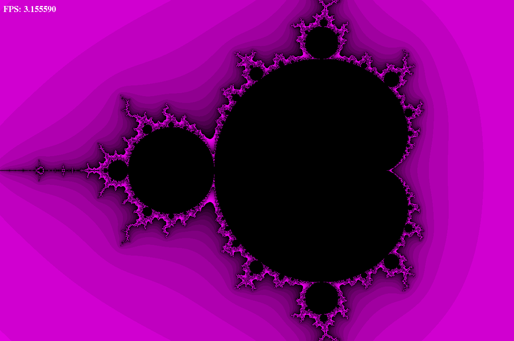
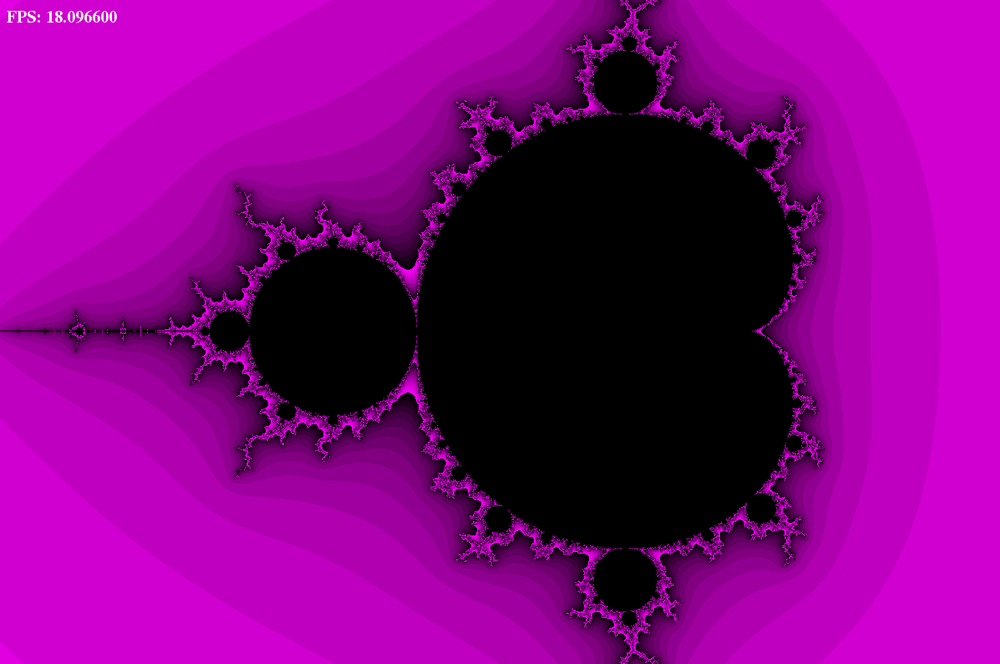

# Laboratory work 3.3.3.<br>Optimization of calculations for points in Mandelbrot fractal with help of intrinsics. Making beautiful graphics with help of SFML

## Contents
- [0. Annotation](#annotation)
- [1. Introduction](#introduction)
- [2. Methods](#methods)
- [3. Results](#results)
- [4. Conclusion](#conclusion)
- [5. Appendix](#appendix)

## Annotation

I made two version for calculations points in Mandelbrot fractal. First version included common cycle of calculations, second version used intrinsics to optimize program. My version with intrinsics showed a 6.26x increase in FPS.

## Introduction

  In graphics and games, it is often necessary to calculate position and color for a large number of points using different algorithms. Optimizing this calculations is may be badly optimized by the compiler, if in your code calculations are implemented by looping calculations for each point separately. This is due to the fact that the compiler doesn't know that the calculations don't depend on each other. So, the programmer has a task to provide this information to the compiler or to realize the calculations using a more effective method. For example, a good way is to combine several numbers in a special register and use special functions built into the compiler to convert all of them. These functions are called intrinsics.

## Methods

  To compare common methods with a method that uses intrinsics, you can perform a few calculations and find the time it takes. To find this time you can use SFML class sf::Time. Also you should consider that time can vary with the state of the system and measure it under the same conditions.

## Results

### Model

  I used the Mandelbrot fractal to test the effectiveness of the intrinsics method because it contains a large number of calculations and allows you to verify the correctness of the calculations using graphics, and because it is easy to write.

  
  <div align="center"> Fig. 1. My graphics of Mandelbrot fractal. Black points is points that belong Mandelbrot fractal, purple points don't belong Mandelbrot fractal and have any shade for beauty visual effect.</div><br>

  Also model have command line argument "ntests" which shows how many times to calculate all points in one screen update. This is so that you can find the time with less error if you have more calculations in one test. By default ntests = 1.

  Some amazing places of my Mandelbrot fractal you can see in Appendix C.

### Measurements

  I made two variants of program for calculate Mandelbrot fractal. First method included common calculations for each point. But with optimization key -O3 compiler optimized it using xmm registers to vectorization some calculations. To compare I made second method where I independently realized vectorization and used intrinsics for calculations. You can read about progress of making program in Appendix A.
  Time measured using the Time class in the sfml library. Each value of time included 120 complete calculations. This is made to make less random error from the experiment. Was used optimization key -O3. The measurements were made at the same time with the same system condition. The obtained values are given in Appendix B. Visual picture of this values you can see in the Figure 2.

  <div align="center"></div>
  <div align="center"> Fig. 2. graph of calculation time dependence for the common variant and for the variant using intrinsics. It is made to visually show the difference in the effectiveness of the two methods with different optimization keys. The y-axis shows the time spent on 120 complete calculations of the fractal in seconds, the x-axis shows the number of the experiment for clarity. Red points are experimental values which were obtained in the common version without optimization keys. Green points are experimental values which were obtained in the common version with optimization key -O3. Orange points for the cycle calculation with intrinsics without optimization keys. Blue points for the cycle calculation with intrinsics and optimization key -O3. Time was measured using the Time class in the sfml library. Each point shows the time of 120 complete calculations. This is made to make less random error from the experiment. The measurements were made at the same time with the same system condition.</div><br>

  You can compare fps in Figure 3 with fps in Figure 4. Fps when using intrinsics is higher than in common code. Measurements were made at the same time and with the same system state.

  
  <div align="center"> Fig. 3. Mandelbrot fractal common version. The compilation was performed without optimization keys. FPS calculated in relize version of program with ntests = 1.</div><br>

   
  <div align="center"> Fig. 4. Mandelbrot fractal with using intrinsics. The compilation was performed with optimization key -O3. FPS calculated in relize version of program with ntests = 1. </div><br>

  I found fps using average time. Results you can see in the Table 1.
  
  | version         | average time of 120 calculations, s ± 10<sup>-6</sup> | average time, s ± 10<sup>-6</sup> |  FPS        |
  |-----------------|-------------------------------------------------------|-----------------------------------|-------------|
  | Common          | 39.573971                                             | 0.329783                          |  3.032297   |
  | Common -O3      | 19.977071                                             | 0.166475                          |  6.006907   | 
  | Intrinsics      | 23.830571                                             | 0.198588                          |  5.035550   |
  | Intrinsics -O3  |  6.326352                                             | 0.052719                          | 18.968493   |

  Fps in version with intrinsics and optimization key -O3 is higher than in first version up to 6.26 times.

## Conclusion

The results show that the use of intrinsics allows to optimize programs, especially it is effective when the same calculations are performed for a lot of data. My version with intrinsics showed a 6.26x increase in FPS. Despite the fact that compiler optimized common version using xmm registers to vectorization some calculations with optimization key -O3, my version with intrinsics have 3.16 times more FPS than common version with key -O3.

## Appendix

### Appendix A. Progress of work

  At first, I did a loop unrolling instead of 1-point loop, to say to compiler that status of this points independent of each other. Then I changed operations with any points to loops and made inline functions to work with array of four float numbers from it. After it I changed my functions for actions with array of four points to intrinsics, that work with type of numbers __m128. It have 128 bit and can include four numbers of type float. The next block of code shows what the main loop of the Mandelbrot calculation looks like using intrinsics.

``` C++
while (true)
{
    __m128 squared_X = _mm_mul_ps (X, X);
    __m128 squared_Y = _mm_mul_ps (Y, Y);
    __m128       X_Y = _mm_mul_ps (X, Y);

    __m128 squared_r = _mm_add_ps (squared_X, squared_Y);

    cmp              = _mm_cmple_ps (squared_r, squared_r_max);

    int mask         = _mm_movemask_ps (cmp);

    if (!mask) break;

    X          = _mm_add_ps (_mm_sub_ps (squared_X, squared_Y), array_X0_dx_scale_index);

    Y          = _mm_add_ps (_mm_add_ps (X_Y, X_Y), array_Y0);

    cmp        = _mm_and_ps(cmp, _mm_set_ps1(1.0f));

    niteration = _mm_add_ps (niteration, cmp);

    cmp        = _mm_cmple_ps (niterationmax, niteration);

    mask       = _mm_movemask_ps (cmp);

    if (mask) break;
}
```

### Appendix B. Experimental values
| N   | Common, s ± 10<sup>-6</sup>  | N   | Common, s ± 10<sup>-6</sup>    |
|-----|------------|-----|------------|
| 1   | 39.586754  | 14  | 39.550892  |
| 2   | 39.535309  | 15  | 39.498867  |
| 3   | 39.734772  | 16  | 39.936852  |
| 4   | 39.546391  | 17  | 39.886246  |
| 5   | 39.525013  | 18  | 39.925900  |
| 6   | 39.608234  | 19  | 39.496441  |
| 7   | 39.636932  | 20  | 39.608109  |
| 8   | 39.844189  | 21  | 39.929169  |
| 9   | 39.729008  | 22  | 39.544987  |
| 10  | 39.813049  | 23  | 39.657738  |
| 11  | 39.504421  | 24  | 39.946037  |
| 12  | 39.622467  | 25  | 39.923641  |
| 13  | 39.513515  |     |            |
  <div align="center"> Tab. 2. Experimental values of time dependence for the common variant. Time was measured using the Time class in the sfml library. Each point shows the time of 120 complete calculations. This is made to make less random error from the experiment. The measurements were made at the same time with the same system condition. Columns "N" - number of measurment.</div><br>

  | N   | Common-O0, s ± 10<sup>-6</sup>   | N   | Common-O0, s ± 10<sup>-6</sup>   |
|-----|-------------|-----|-------------|
| 1   | 39.875515   | 15  | 39.651768   |
| 2   | 39.541359   | 16  | 39.600506   |
| 3   | 39.528011   | 17  | 39.586075   |
| 4   | 39.561279   | 18  | 39.549995   |
| 5   | 39.501640   | 19  | 39.583961   |
| 6   | 39.526173   | 20  | 39.816147   |
| 7   | 39.534252   | 21  | 39.920002   |
| 8   | 39.553780   | 22  | 39.572174   |
| 9   | 39.586887   | 23  | 39.662708   |
| 10  | 39.926250   | 24  | 39.665886   |
| 11  | 39.645107   | 25  | 39.566689   |
| 12  | 40.015049   | 26  | 39.579334   |
| 13  | 39.580147   | 27  | 39.681812   |
| 14  | 39.537243   |     |             |
  <div align="center"> Tab. 3. Experimental values of time dependence for the common variant with optimization key -O0. Time was measured using the Time class in the sfml library. Each point shows the time of 120 complete calculations. This is made to make less random error from the experiment. The measurements were made at the same time with the same system condition. Columns "N" - number of measurment.</div><br>

| N   | Common-O3, s ± 10<sup>-6</sup>   | N   | Common-O3, s ± 10<sup>-6</sup>   |
|-----|-------------|-----|-------------|
| 1   | 20.129501   | 15  | 19.933502   |
| 2   | 20.167023   | 16  | 19.938637   |
| 3   | 20.144922   | 17  | 19.938656   |
| 4   | 20.127441   | 18  | 19.929199   |
| 5   | 19.934141   | 19  | 19.913401   |
| 6   | 19.930944   | 20  | 19.926769   |
| 7   | 19.921576   | 21  | 19.930563   |
| 8   | 19.926151   | 22  | 19.932163   |
| 9   | 19.924517   | 23  | 19.926888   |
| 10  | 19.934677   | 24  | 19.939827   |
| 11  | 20.086153   | 25  | 19.913111   |
| 12  | 20.171812   | 26  | 19.921955   |
| 13  | 20.156691   | 27  | 20.092337   |
| 14  | 20.191521   |     |             |
 <div align="center"> Tab. 4. Experimental values of time dependence for the common variant with optimization key -O3. Time was measured using the Time class in the sfml library. Each point shows the time of 120 complete calculations. This is made to make less random error from the experiment. The measurements were made at the same time with the same system condition. Columns "N" - number of measurment.</div><br>

| N   | Intrinsics, s ± 10<sup>-6</sup>  | N   | Intrinsics, s ± 10<sup>-6</sup>  |
|-----|-------------|-----|-------------|
| 1   | 23.971806   | 13  | 24.111734   |
| 2   | 22.895058   | 14  | 24.154701   |
| 3   | 23.211262   | 15  | 23.291079   |
| 4   | 24.494003   | 16  | 24.241161   |
| 5   | 24.201456   | 17  | 23.346539   |
| 6   | 23.046597   | 18  | 24.422501   |
| 7   | 24.715744   | 19  | 24.853439   |
| 8   | 23.079561   | 20  | 23.955698   |
| 9   | 23.339951   | 21  | 23.212400   |
| 10  | 24.060940   | 22  | 23.666491   |
| 11  | 24.193596   | 23  | 24.721247   |
| 12  | 23.372887   | 24  | 24.741751   |
<div align="center"> Tab. 5. Experimental values of time dependence for the variant with intrinsics. Time was measured using the Time class in the sfml library. Each point shows the time of 120 complete calculations. This is made to make less random error from the experiment. The measurements were made at the same time with the same system condition. Columns "N" - number of measurment.</div><br>

| N   | Intrinsics-O0, s ± 10<sup>-6</sup> | N   | Intrinsics-O0, s ± 10<sup>-6</sup> |
|-----|---------------|-----|---------------|
| 1   | 22.952927     | 16  | 24.940582     |
| 2   | 22.549068     | 17  | 23.444176     |
| 3   | 22.982044     | 18  | 23.847813     |
| 4   | 23.598991     | 19  | 23.819757     |
| 5   | 24.377777     | 20  | 24.681707     |
| 6   | 24.310888     | 21  | 24.901627     |
| 7   | 24.468403     | 22  | 23.835629     |
| 8   | 23.616400     | 23  | 24.897612     |
| 9   | 23.327295     | 24  | 23.433050     |
| 10  | 24.296551     | 25  | 23.767220     |
| 11  | 23.171297     | 26  | 23.994524     |
| 12  | 23.572229     | 27  | 24.954897     |
| 13  | 24.082523     | 28  | 23.535872     |
| 14  | 24.773478     | 29  | 24.032150     |
| 15  | 23.281050     | 30  | 23.870794     |
<div align="center"> Tab. 6. Experimental values of time dependence for the variant with intrinsics with optimization key -O0. Time was measured using the Time class in the sfml library. Each point shows the time of 120 complete calculations. This is made to make less random error from the experiment. The measurements were made at the same time with the same system condition. Columns "N" - number of measurment.</div><br>

| N   | Intrinsics-O3, s ± 10<sup>-6</sup> | N   | Intrinsics-O3, s ± 10<sup>-6</sup> |
|-----|---------------|-----|---------------|
| 1   | 6.336559      | 16  | 6.315622      |
| 2   | 6.394453      | 17  | 6.318503      |
| 3   | 6.433603      | 18  | 6.331072      |
| 4   | 6.348865      | 19  | 6.315866      |
| 5   | 6.396700      | 20  | 6.323253      |
| 6   | 6.319700      | 21  | 6.341492      |
| 7   | 6.312135      | 22  | 6.330636      |
| 8   | 6.315808      | 23  | 6.310057      |
| 9   | 6.323038      | 24  | 6.330318      |
| 10  | 6.326257      | 25  | 6.392965      |
| 11  | 6.311866      | 26  | 6.381490      |
| 12  | 6.320442      | 27  | 6.394530      |
| 13  | 6.321612      | 28  | 6.385856      |
| 14  | 6.323684      | 29  | 6.395294      |
| 15  | 6.305323      | 30  | 6.407150      |
<div align="center"> Tab. 7. Experimental values of time dependence for the variant with intrinsics with optimization key -O3. Time was measured using the Time class in the sfml library. Each point shows the time of 120 complete calculations. This is made to make less random error from the experiment. The measurements were made at the same time with the same system condition. Columns "N" - number of measurment.</div><br>


SFML class time has instrumental error about 1 ms.

### Appendix C. Some amazing places

  
  <div align="center"> Fig. 5. First beauty place</div><br>

  
  <div align="center"> Fig. 6. Second beauty place </div><br>

  
  <div align="center"> Fig. 7. Third beauty place</div><br>

  
  <div align="center"> Fig. 8. Last beauty place</div><br>
